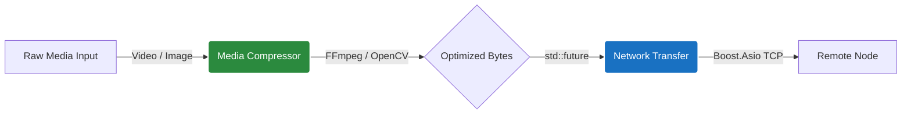
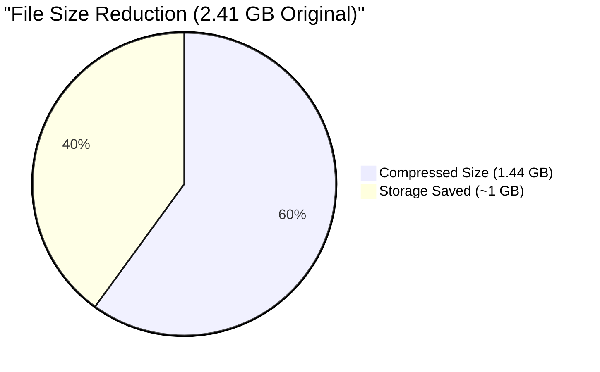

<div align="center">
  <h1>🎬 libmedia_compress_net</h1>
  <p><b>High-Performance C++17 Media Compression & Network Transmission Library</b></p>

  [](#)
  [](#)
  [](#)
  [](#)

  <p align="center">
    <a href="#key-features">Features</a> •
    <a href="#architecture">Architecture</a> •
    <a href="#benchmarks">Benchmarks</a> •
    <a href="#getting-started">Installation</a> •
    <a href="#usage">Usage</a> •
    <a href="#contributing">Contributing</a>
  </p>
</div>

---

## 🚀 Overview

`libmedia_compress_net` is a production-ready C++ library designed for seamless media compression and asynchronous network transmission. Built with standard C++17 and powered by industry-standard backend tools (`FFmpeg`, `OpenCV`, `libwebp`, and `Boost.Asio`), it abstracts away the complex boilerplate of native media encoding and socket programming.

Whether you're building a distributed transcoding farm, a peer-to-peer file sharing application, or simply need to reliably crush a 2.5GB MKV file down to size before sending it over the network, this library provides a clean, asynchronous `std::future` based API.

---

## ✨ Key Features

- **Media Compression Engine**:
  - **Video**: Asynchronous encoding via FFmpeg wrapper (H.264/libx264, configurable CRF and presets).
  - **Images**: Fast image resizing and WebP conversion via OpenCV.
- **Tri-Mode Network Transfer**:
  - **LAN**: High-throughput direct stream using asynchronous `Boost.Asio` TCP sockets.
  - **WAN**: Chunked HTTP/REST uploads *(Experimental/Stub)*.
  - **P2P**: Direct STUN/ICE traversal with UDP streams *(Experimental/Stub)*.
- **Modern C++ API**: Fully non-blocking asynchronous execution utilizing `std::future` and `std::async`.

---

## 🏗 Architecture



---

## 📊 Benchmarks

Our FFmpeg wrapper introduces zero overhead compared to native CLI execution while providing a clean programmatic interface. Below is a real-world benchmark compressing a **2.41 GB 1080p MKV** movie file using the `ultrafast` preset at `CRF 28`:



| Metric | Original | Compressed | Savings |
|---|---|---|---|
| **File Size** | 2.41 GB | 1.44 GB | **~40%** |
| **Encode Time** | N/A | 9m 02s | N/A |
| **Audio** | AAC 5.1 | AAC 5.1 | (Stream Copied) |

---

## 📦 Getting Started

### Prerequisites
- **Compiler**: C++17 compatible compiler (GCC, Clang)
- **Build System**: CMake >= 3.15
- **Dependencies**: 
  - `Boost` (system)
  - `OpenCV 4`
  - `FFmpeg` (ffmpeg CLI installed and available in PATH)
  - `libwebp`
  - `pkg-config`

### Building from Source

```bash
# Clone the repository
git clone https://github.com/your-org/optimedia.git
cd optimedia

# Configure and build
mkdir build && cd build
cmake .. -DCMAKE_BUILD_TYPE=Release
cmake --build . -j$(nproc)

# (Optional) Run tests
ctest -C Release
```

### CMake Integration

To use `libmedia_compress_net` in your own project, you can add it as a subdirectory:

```cmake
add_subdirectory(media_compress_net)
target_link_libraries(your_app PRIVATE media_compress_net)
```

---

## 💻 Usage

The API is heavily optimized for asynchronous workflows.

### 1. Compressing and Sending a Video over LAN

```cpp
#include <media_compress_net/MediaCompressor.hpp>
#include <media_compress_net/NetworkTransfer.hpp>
#include <iostream>

int main() {
    mcn::MediaCompressor compressor;
    
    // Configure compression parameters
    mcn::VideoCompressConfig config;
    config.crf = 28;                 // Lower is higher quality
    config.preset = "ultrafast";     // Fast encoding speed
    config.target_width = 1920;
    config.target_height = 1080;
    
    // Start background compression
    auto compress_task = compressor.compress_video_async("raw_movie.mkv", "compressed.mkv", config);
    
    // Wait for compression to finish
    if (compress_task.get()) {
        std::cout << "✅ Video compressed successfully!\n";
        
        // Transfer over local network asynchronously
        mcn::LANTransfer lan("192.168.1.100", 8080);
        auto send_task = lan.send_file("compressed.mkv");
        
        if (send_task.get()) {
            std::cout << "✅ File successfully transferred to target node!\n";
        }
    }
    
    return 0;
}
```

### 2. Fast Image Compression (WebP)

```cpp
mcn::ImageCompressConfig img_config;
img_config.quality = 85;

// Assuming raw_jpeg_bytes is a std::vector<uint8_t>
auto future_img = compressor.compress_image_async(raw_jpeg_bytes, img_config);

// Retrieve WebP optimized bytes
std::vector<uint8_t> optimized_webp = future_img.get();
```

---

## 🤝 Contributing

We welcome contributions from the community! Whether it's fixing bugs, adding new network modes (like finishing the P2P stub), or optimizing the CMake scripts.

1. **Fork the repository** and create your feature branch: `git checkout -b feature/my-new-feature`
2. **Ensure cross-platform stability**: We highly value native Linux builds.
3. **Write tests**: Ensure any new C++ functionality is covered in the `/tests` directory.
4. **Commit your changes**: `git commit -am 'Add some feature'`
5. **Push to the branch**: `git push origin feature/my-new-feature`
6. **Submit a Pull Request**: Detail your changes, benchmarks, and reasoning.

Please read our [Code of Conduct](CODE_OF_CONDUCT.md) for details on our community standards.

---

## 📄 License

This project is licensed under the MIT License. See the [LICENSE](LICENSE) file for details.
