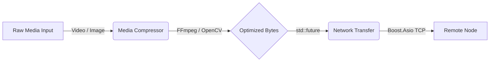

# Optimedia 0.1

Optimedia is a high-performance C++17 library designed for media compression and asynchronous network transmission. Built on industry-standard backend tools (FFmpeg, OpenCV, libwebp, and Boost.Asio), it abstracts the complexities of native media encoding and socket programming into a robust, asynchronous API.

## Core Capabilities

*   **Media Compression Engine**
    *   **Video**: Asynchronous encoding via FFmpeg wrapper (H.264/libx264).
    *   **Images**: Optimized resizing and WebP conversion via OpenCV.
*   **Tri-Mode Network Transfer**
    *   **LAN**: High-throughput direct streaming via asynchronous Boost.Asio TCP sockets.
    *   **WAN**: Chunked HTTP/REST uploads *(Experimental)*.
    *   **P2P**: Direct STUN/ICE traversal with UDP streams *(Experimental)*.
*   **Asynchronous API**: Fully non-blocking execution utilizing `std::future`.

## Architecture



## Performance Benchmarks

The FFmpeg integration introduces minimal overhead compared to native CLI execution. Below is a real-world benchmark compressing a 2.41 GB 1080p MKV file using the `ultrafast` preset at CRF 28.

| Metric | Original | Compressed | Delta |
|---|---|---|---|
| **File Size** | 2.41 GB | 1.44 GB | ~40% Reduction |
| **Encode Time** | - | 9m 02s | - |

## Installation

### Prerequisites

*   Compiler supporting C++17 (GCC, Clang)
*   CMake >= 3.15
*   System Dependencies: `Boost` (system), `OpenCV 4`, `FFmpeg` (CLI in PATH), `libwebp`, `pkg-config`

### Build Instructions

```bash
git clone https://github.com/ApoorvNegi17/optimedia.git
cd optimedia

mkdir build && cd build
cmake .. -DCMAKE_BUILD_TYPE=Release
cmake --build . -j$(nproc)
```

### CMake Integration

To integrate Optimedia into an existing project:

```cmake
add_subdirectory(optimedia)
target_link_libraries(your_target PRIVATE media_compress_net)
```

## Usage Example

The API handles heavy tasks in background threads, returning a `std::future`.

```cpp
#include <media_compress_net/MediaCompressor.hpp>
#include <media_compress_net/NetworkTransfer.hpp>
#include <iostream>

int main() {
    mcn::MediaCompressor compressor;
    
    mcn::VideoCompressConfig config;
    config.crf = 28;
    config.preset = "ultrafast";
    config.target_width = 1920;
    config.target_height = 1080;
    
    auto compress_task = compressor.compress_video_async("raw_movie.mkv", "compressed.mkv", config);
    
    if (compress_task.get()) {
        std::cout << "Video compressed successfully.\n";
        
        mcn::LANTransfer lan("192.168.1.100", 8080);
        auto send_task = lan.send_file("compressed.mkv");
        
        if (send_task.get()) {
            std::cout << "File transferred successfully.\n";
        }
    }
    
    return 0;
}
```

## License

This project is licensed under the MIT License. See the [LICENSE](LICENSE) file for details.
